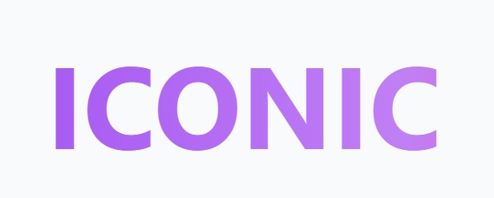

# ICONIC

<div align="center">
  
  <h3>Turning wishes and style into memorable moments</h3>
  <p>A revolutionary platform built for immersive, community-driven events in network cities like Infinita</p>
  
  [](https://iconicxp.netlify.app)
</div>

## 📋 Table of Contents

- [ICONIC](#iconic)
  - [📋 Table of Contents](#-table-of-contents)
  - [🌟 Overview](#-overview)
  - [💼 Business Model](#-business-model)
    - [For Event Creators:](#for-event-creators)
    - [For Users:](#for-users)
    - [Revenue Streams:](#revenue-streams)
  - [✨ Features](#-features)
  - [🛠️ Technology Stack](#️-technology-stack)
  - [🚀 Getting Started](#-getting-started)
    - [Prerequisites](#prerequisites)
    - [Installation](#installation)
      - [Clone the repository](#clone-the-repository)
      - [Frontend Setup](#frontend-setup)
      - [Backend Setup](#backend-setup)
    - [Environment Configuration](#environment-configuration)
      - [Frontend (.env)](#frontend-env)
      - [Backend (.env)](#backend-env)
  - [📁 Project Structure](#-project-structure)
  - [🗺️ Roadmap](#️-roadmap)
  - [👥 Team](#-team)
  - [🔗 Links](#-links)

## 🌟 Overview

ICONIC is a community-first event platform designed for network cities like Infinita, where culture, governance, and identity converge. Our mission is to empower people to create and join immersive events with real-time social dynamics, building lasting communities beyond the moment.

ICONIC transforms events into gateways for deeper participation in city life. Users join with a single wallet approval, gain verified access through onchain identity, and connect via dynamic social mechanics like real-time matchmaking. Event creators can issue perks, create gated experiences, and foster long-term communities, all within a system that supports local credits and civic alignment.

We’re proudly participating in multiple tracks at the Infinita City Hackathon:

🗳 Governance Infrastructure – community-managed event access and reputation

🧬 Onchain Identity – verifiable event participation and social graph

💸 Local Economies – credit-based engagement, tipping, and perks

🏛 Public Goods & Civic Tech – culture as infrastructure

🌀 Wildcard / Experimental – reinventing the social layer of cities

ICONIC isn’t just an event tool, it’s the social engine for the networked societies of tomorrow.

## 💼 Business Model

ICONIC is built as a multi-sided platform that empowers both event creators and attendees, while reinforcing the culture and economy of network cities.

### For Event Creators:
- **Host with Purpose**: Create interactive, onchain events that generate community, not just attendance  
- **Earn Transparently**: Monetize through ticketing, perks, and membership — keeping 90% of the revenue  
- **Build Community**: Retain participants through post-event chats, follow-ups, and recurring gatherings  
- **Manage Access**: Use onchain identity to create gated or tiered experiences for citizens, holders, or members  

### For Attendees:
- **One-Click Entry**: Join events with a single wallet approval  
- **Real Interaction**: Match with other users based on interests, and engage through live dynamics  
- **Stay Connected**: Participate in ongoing conversations and future events within the same space  
- **Earn & Enjoy**: Get rewarded with local credits and perks for attending and engaging  

### Revenue Streams:
1. **Creator Subscriptions**: Monthly plans with access to advanced tools  
2. **Event Fees**: Small cut on ticket sales and credit redemptions  
3. **Membership Layer**: Premium identity features and gated experiences  
4. **Promoted Events**: Sponsored visibility inside the ecosystem  

Our model fuels sustainable community-building, making each event a node in the social infrastructure of cities like Infinita.

## ✨ Features

- **Recommendation Engine**: Token-based and preference-driven content recommendations
- **Secure Blockchain Transactions**: Transparent and immutable record-keeping
- **Creator Dashboard**: Analytics and audience insights
- **User Preference Center**: Detailed control over content discovery
- **Smart Contract Integration**: Automated royalty distribution
- **Mobile-First Design**: Optimized for on-the-go experiences

## 🛠️ Technology Stack

- **Frontend**: React, TypeScript, TailwindCSS, Firebase Authentication
- **Backend**: Node.js, NestJs
- **Database**: PostgreSQL (via Supabase), Redis
- **Authentication**: Firebase Authentication, JWT
- **Storage**: Firebase Storage, Supabase Storage
- **Blockchain**: Base Sepolia(testnet)
- **Smart Contracts**: Solidity (deployed on Base Sepolia)
- **Deployment**: Vercel (frontend), AWS (backend)/Render

## 🚀 Getting Started

### Prerequisites

- Node.js (v16 or higher)
- npm or yarn
- Git

### Installation

#### Clone the repository

```bash
git clone https://github.com/nicollasisaac/iconic-infinita.git
cd iconic-infinita
```

#### Frontend Setup

```bash
cd frontend
npm install
npm run dev
```

The frontend will be available at `http://localhost:3000`

#### Backend Setup

```bash
cd backend
npm install
npm run dev:start
```

The backend API will be available at `http://localhost:8000`

### Environment Configuration

> ⚠️ **IMPORTANT**: The project requires `.env` files with specific credentials to function properly. For security reasons, these credentials are not included in the repository.

#### Frontend (.env)

Create an `.env` file in the `frontend` folder with the following variables:

```
# API endpoint for the backend
VITE_API_BASE=http://localhost:3000
# Firebase configuration (use real values or request from team)
VITE_FIREBASE_API_KEY=<ask team>
VITE_FIREBASE_AUTH_DOMAIN=<ask team>
VITE_FIREBASE_PROJECT_ID=<ask team>
VITE_FIREBASE_STORAGE_BUCKET=<ask team>
VITE_FIREBASE_MESSAGING_SENDER_ID=<ask team>
VITE_FIREBASE_APP_ID=<ask team>
VITE_FIREBASE_MEASUREMENT_ID=<ask team>
# Smart contract for paywall (Base Sepolia)
VITE_PAYWALL_ADDRESS=<Base Sepolia contract address>
# Public API URL
VITE_API_URL=http://localhost:3000

```

#### Backend (.env)

Create an `.env` file in the `backend` folder with the following variables:

```
# Supabase Configuration
SUPABASE_URL=<ask team>
SUPABASE_SERVICE_ROLE_KEY=<ask team>
# Auth Config
JWT_SECRET=<ask team>
JWT_EXPIRATION=20m
# Firebase Config
FIREBASE_PROJECT_ID=<ask team>
FIREBASE_CREDENTIALS_PATH=src/config/firebase-service-account.json
FIREBASE_SERVICE_ACCOUNT_BASE64=<ask team>
# Database Config
DATABASE_URL=<ask team>
# Redis Config
REDIS_HOST=<ask team>
REDIS_PORT=<ask team>
REDIS_PASSWORD=<ask team>
# Blockchain (Base Sepolia RPC)
BASE_RPC_URL=https://sepolia.base.org

```

> 📝 **Note**: To obtain the necessary credentials, please contact the ICONIC team. Without these configurations, the project will not work locally.

## 📁 Project Structure

```
iconic/
├── frontend/          # React frontend application
├── backend/           # Node.js backend API
├── contracts/         # Base smart contracts
└── README.md          # Project documentation
```

## 🗺️ Roadmap

- **Q3 2025**: Launch of creator onboarding program and initial user testing
- **Q4 2025**: Public beta release with core functionality
- **Q1 2026**: Full platform launch with enhanced features
- **Q2 2026**: International expansion and partnership program

## 👥 Team

Our passionate and multidisciplinary team combines expertise in blockchain development, user experience design, and business strategy:

- **[Nicollas Isaac](https://www.linkedin.com/in/nicollas-isaac/)** - Blockchain Development & Systems Architecture
- **[Fernando Soares de Oliveira](https://www.linkedin.com/in/fernando-soares-de-oliveira/)** - User Experience & Product Design
- 
## 🔗 Links

- **Live Demo**: [iconic-seven.vercel.app](https://iconicxp.netlify.app/)
- **GitHub Repository**: [github.com/iconic-team-ofc/iconic](https://github.com/nicollasisaac/iconic-infinita.git)
- **DEMO VIDEO**: [YouTube](https://www.youtube.com/watch?v=61X6j7rp7j8)
---

<div align="center">
  <p>Powered by Infinita City Hackaton</p>
  <p>© 2025 ICONIC. All rights reserved.</p>
</div>
